# 🛍️ PocketShop Fullstack
|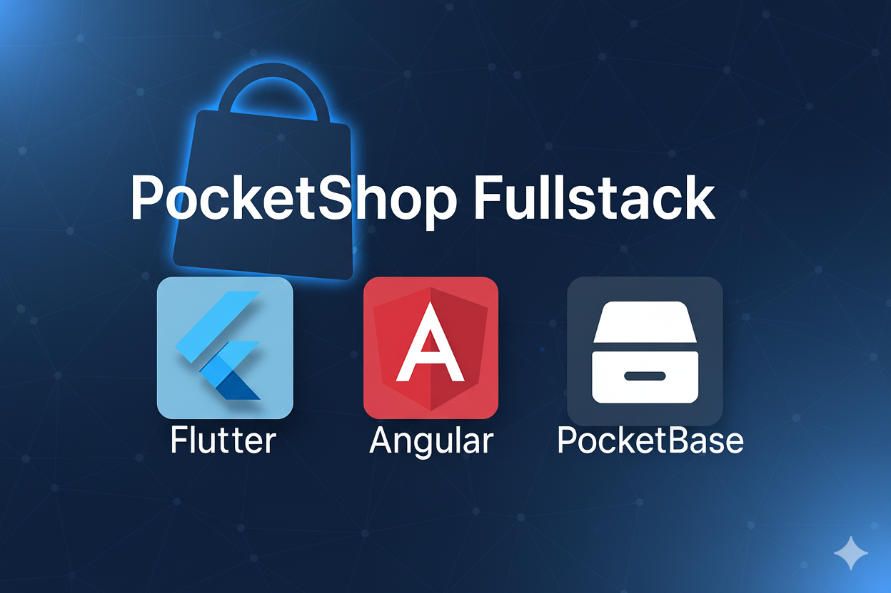 | 
|:-------------:|
---
<p align="center">      </p>

A **full-stack e-commerce system** built with **PocketBase**, **Flutter**, and **Angular**, designed for modern scalability and real-time performance.  
>This project is still **under active development**, but it already demonstrates advanced integration between a custom backend, mobile, and web interfaces.

 

## 🚀 Overview

**PocketShop Fullstack** is a multi-platform e-commerce solution featuring:
- 🗄️ **PocketBase Backend** — for data storage, authentication, and APIs.
- 📱 **Flutter Mobile App** — for Android, iOS, Windows, Linux, and macOS.
- 🌐 **Angular Web App** — for the browser-based shopping experience.

All components are connected seamlessly through **PocketBase REST APIs**.

---

## 🧠 System Architecture

| Flutter App | <----> | PocketBase | <----> | Angular Web |
|--------------|--------|-------------|---------|--------------|
| (Mobile/Desktop) | | (Backend & Admin) | | (Frontend UI) |

Each module communicates via PocketBase’s REST API, ensuring synchronized data between platforms.

---

## 🖼️ Web Preview

| Main Screen | Main Screen|
|:-------------:|:-----------:|
| 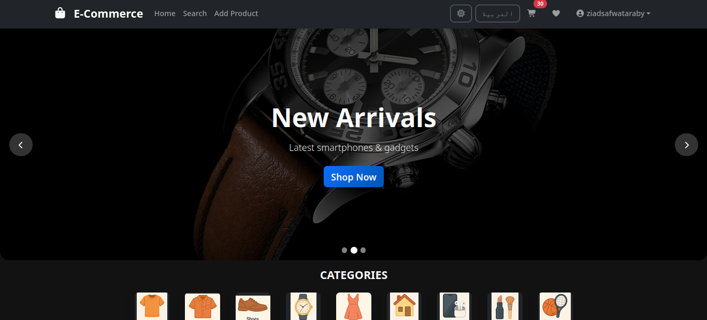 | 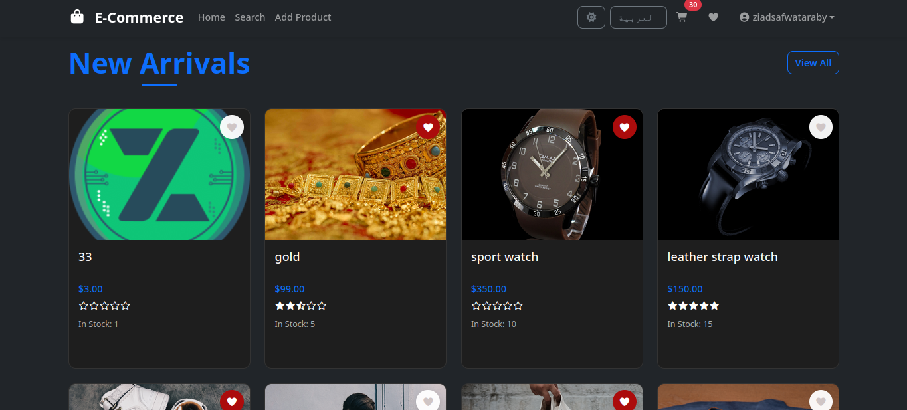 |

| details Screen| comments part|
|:-------------:|:-----------:|
| 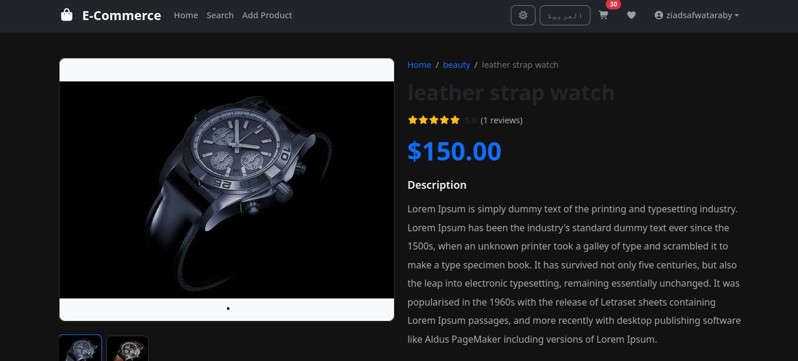 | 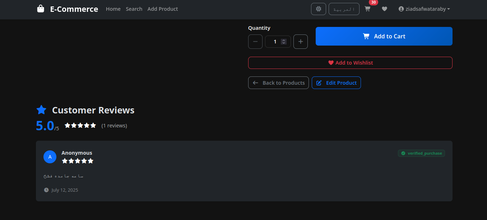 |

| Edit product(admin only) Screen| WishList Screen|
|:-------------:|:-----------:|
| 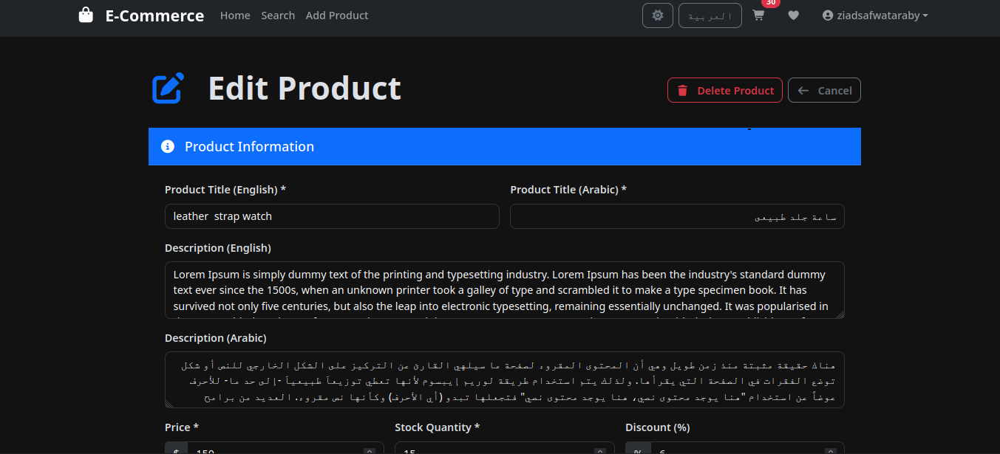 | 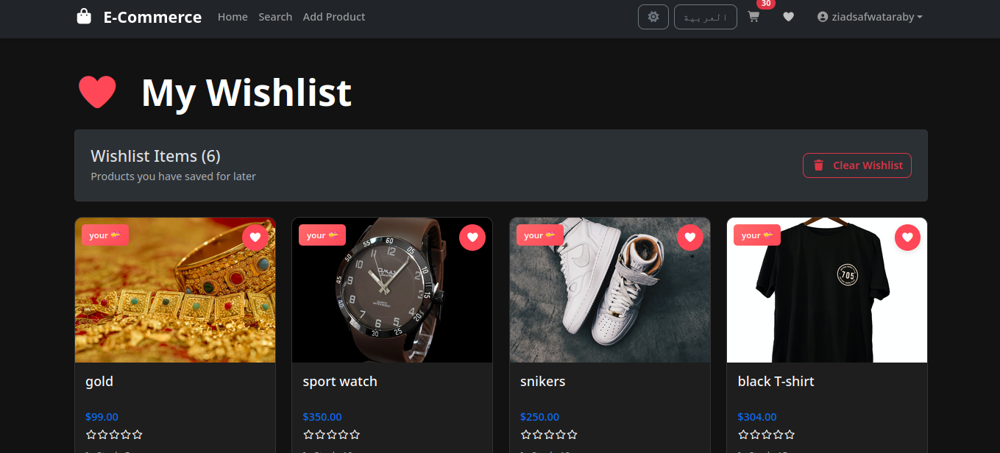 |

| Cart Screen| Search Screen|
|:-------------:|:-----------:|
| 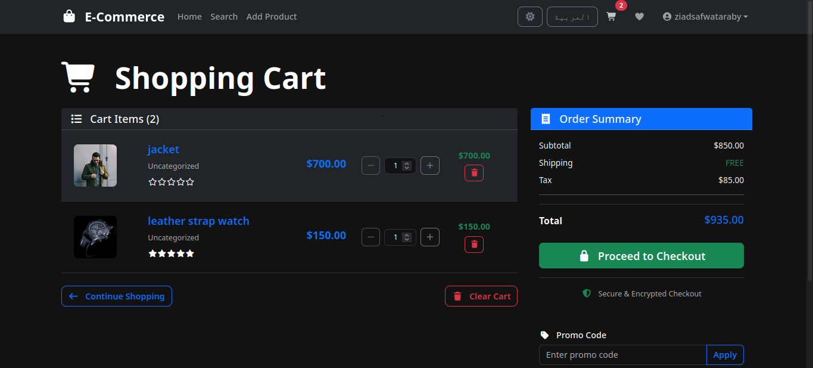 | 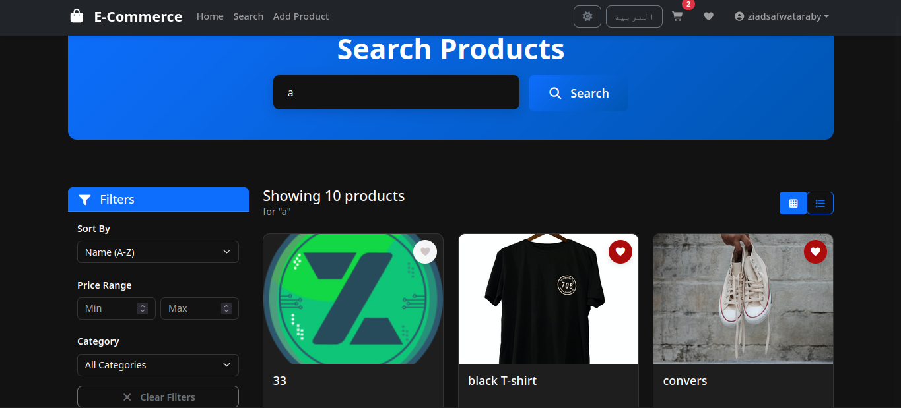 |


## 🖼️ Mobile Preview

| Mobile Preview | 
|:-------------:|
| 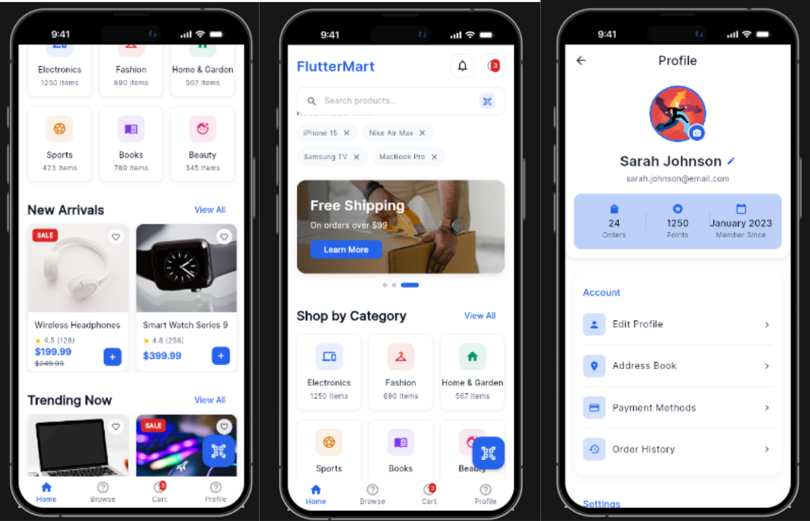 | 

## 🖼️ DashBoard Preview

| DashBoard(Super admin) Screen | DashBoard(Super admin) Screen|
|:-------------:|:-----------:|
| 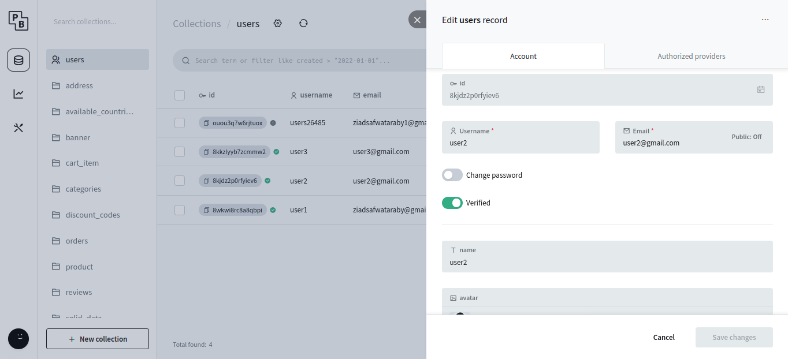 | 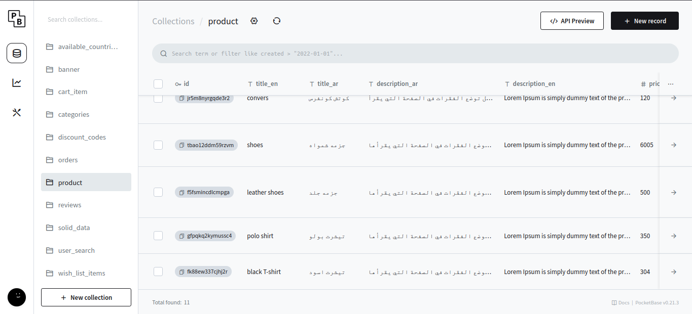 |
---

## 📂 Project Structure
```
PocketShop-Fullstack/
│
├── Backend-PB/ # PocketBase backend (data, hooks, storage)
│ ├── pb_data/ # Database and storage
│ ├── pb_hooks/ # Custom JavaScript logic for triggers and rules
│ ├── swagger/ # API documentation
│ ├── pocketbase # PocketBase server executable (Linux)
│ └── pocketbase.exe # PocketBase server executable (Windows)
│
├── E-Commerce-Mobile-App/ # Flutter mobile app
│ ├── lib/ # Application code
│ ├── assets/ # Images and icons
│ ├── android/, ios/, web/ # Platform-specific code
│ └── pubspec.yaml # Flutter dependencies
│
└── Website-Angular/ # Angular web frontend
├── src/app/ # Components, pages, and services
├── angular.json # Angular config
└── package.json # Dependencies
```
---

## ⚙️ PocketBase Schema

| Collection | Description |
|-------------|-------------|
| **users** | Authentication system with roles (`admin`, `user`) |
| **product** | Product listings with images, categories, colors, and sizes |
| **categories** | Nested product categories with images |
| **orders** | User orders with statuses and linked discounts |
| **discount_codes** | Promo codes with limits and expiry dates |
| **cart_item** | Shopping cart items with user-product relations |
| **wish_list_items** | Wishlist management per user |
| **reviews** | Product reviews with rating and comments |
| **address** | User addresses (country, city, street, postal code) |
| **banner** | Home banners with images and links |
| **available_countries_cites** | JSON-based country and city availability |
| **user_search** | Search history for personalization |

> 💾 **PocketBase Admin Dashboard (demo)**  
> - **Email:** `system@gmail.com`  
> - **Password:** `1234567890`  
> ⚠️ *Change these in production for security.*

> 💾 **App or Web  (demo email)**  
> - **Email:** `ziad@gmail.com`  
> - **Password:** `1234567890`  
> ⚠️ *Change these in production for security.*
---

## 🧩 Backend Hooks

Custom backend hooks are implemented in the `pb_hooks` folder to extend PocketBase functionality — e.g., validation, custom logic, and automated triggers.

---

## ⚙️ Features

- 🔐 User authentication & role-based access  
- 🛒 Product management (CRUD)  
- 💳 Orders & checkout system  
- 💬 Reviews and ratings  
- 📸 Image upload using PocketBase storage  
- 🌐 REST API + custom endpoints  
- 🎨 Responsive UI with Flutter & Angular  
- 🧩 Modular architecture for easy scaling  

---

## 🧠 Custom Routes (PocketBase)

PocketShop extends PocketBase with **custom routes** to handle business logic beyond CRUD.  
These are defined in `main.pb.js` and loaded automatically at runtime.

### Example Custom Routes

| Method | Endpoint | Description |
|---------|-----------|-------------|
| `POST` | `/api/cart/add` | Add a product to a user’s cart |
| `GET` | `/api/cart/:userId` | Retrieve cart details for a specific user |
| `POST` | `/api/orders/checkout` | Create a new order and clear the cart |
| `GET` | `/api/products/search/:query` | Search for products by keyword |
| `POST` | `/api/auth/custom-login` | Custom user authentication logic |

**Example (main.pb.js):**
```js
router.post('/api/cart/add', (c) => {
    const userId = c.request.query.get('userId');
    const productId = c.request.query.get('productId');
    return c.json({ message: `Product ${productId} added to user ${userId}` });
});
```

# 📱 Flutter App (Mobile & Desktop)
## ✨ Key Features

- Clean Arch with Bloc pattern for state management
   
- Modern UI built  

- PocketBase API integration

- Categories, product details, cart, and search

- Authentication and profile management

- Cross-platform support: Android, iOS, Web, Windows, Linux, macOS

### ▶️ Run the app
```bash
cd E-Commerce-Mobile-App
flutter pub get
flutter run
```

# 🌐 Angular Website
## ✨ Features

- Clean, responsive, and modern interface

- Admin product management (add/edit)

- Authentication and protected routes

- Dynamic product catalog with search and filtering

- Integrated with PocketBase APIs

### ▶️ Run the web app
```bash
cd Website-Angular
npm install
ng serve
```
-  Then open http://localhost:4200
# 🗄️ Backend (PocketBase)
### ▶️ Run the backend
```bash
cd Backend-PB
./pocketbase serve
```
- PocketBase runs by default on
- ```http://127.0.0.1:8090```
- Admin dashboard:
- ```http://127.0.0.1:8090/_/```
# 🧰 Tech Stack

| Layer            | Technology                   |
| ---------------- | ---------------------------- |
| Backend          | PocketBase                   |
| Web Frontend     | Angular                      |
| Mobile App       | Flutter                      |
| Languages        | Dart, TypeScript, JavaScript |
| Architecture     | Clean Architecture (Flutter) |
| State Management | Bloc (Flutter)               |

 
# 🔮 Future Improvements

- 🧾 Payment integration (Stripe/Paymob)

- 🧠 AI-powered product recommendations

- 📦 Advanced admin dashboard for analytics

- 🪄 Push notifications for offers
>  🧱 PocketShop Fullstack is currently in development — stay tuned for updates!

# 🧑‍💻 Author

## Ziad El-Araby
> Full-Stack Dotnet Developer | Flutter & Angular Enthusiast

📧 **Email:** [Ziadsafwataraby@gmail.com](mailto:Ziadsafwataraby@gmail.com)  
🔗 **Website:** [MyWebsite](https://ziadsafwat.github.io/Ziad-Safwat-Portfolio/)  
🔗 GitHub: @ZiadSafwat

 

 
## 📜 License
This project is licensed under the MIT License.


# ⭐ Support the Project

### If you like PocketShop Fullstack, please consider giving it a star ⭐ on GitHub!
Or support development [👉 ☕ Buy Me a Coffee](https://bmc.link/ziadsafwat1)
